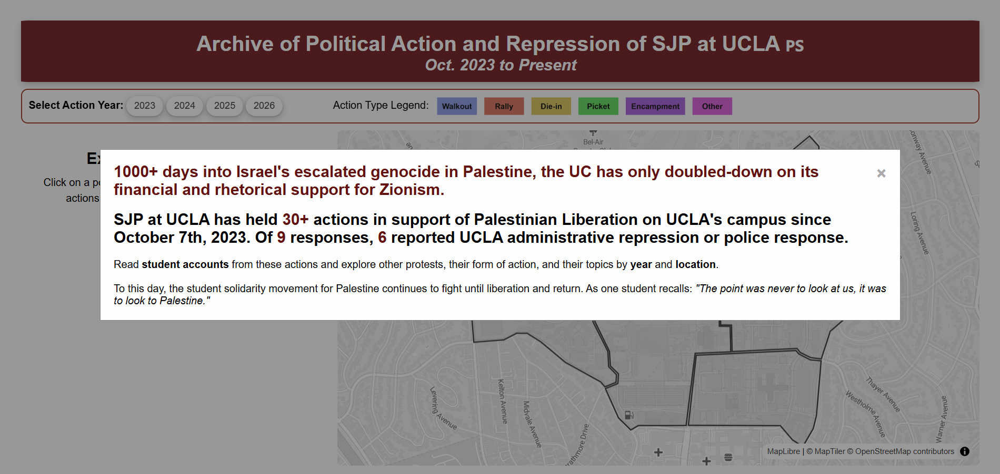
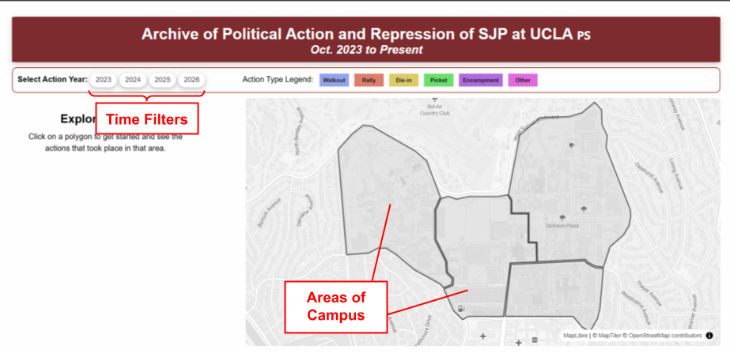
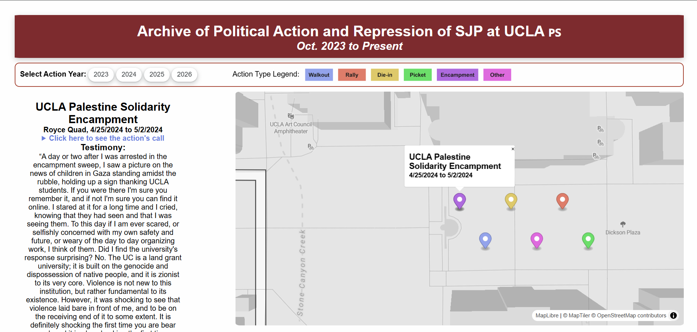

# Political Action and Repression of SJP at UCLA

## Table of Contents

* [Project Objectives](#project-objectives)
    * [Empowering SJP at UCLA](#empowering-sjp-at-ucla)
* [Technology](#technology)
    * [What is this site?](#what-is-this-site)
    * [How it works](#how-it-works)
    * [For the future](#for-the-future)

## Project Objectives
The project aims to create an archive of Students for Justice in Palestine (SJP) at UCLA’s public-facing protests and associated repression since the escalated genocide in Palestine began on October 7th, 2023. Such a resource aims to demonstrate the effect of UCLA’s continuous institutional repression of the Palestinian Liberation Movement, combat UCLA's self-described progressive image, and ensure that the collective memory of political action for Palestinian liberation endures and can be passed down to future generations of students.

### Empowering SJP at UCLA

In creating this site, we hope to empower Students for Justice in Palestine at UCLA, their members, and the events they host on campus. By creating an archive of events, our mapplication allows new and prospective students to explore the history of SJP’s activities and learn about the experiences of former participants. Additionally, event organizers may use this resource to reflect on past instances of repression to plan effective political actions in the future.

## Technology
### What is this site?
This website is formed with javascript, html, and css. We utilize the open-source MapLibreGL library to display a map with markers on the site. We additionally utilize the open-source Papa Parse library to help us process Google Form survey data and archival data documented in a Google Spreadsheet. 

### How it works:
Testimonials from SJP members were collected using a Google Form and documented in a spreadsheet. This spreadsheet additionally contains an archive of all public SJP actions from Oct. 7 2023 - July 2026 (what is our present). This sheet is linked in init.js (our javascript file) where a function from the Papa Parse library reads in the spreadsheet data. We've written functions that sort the data into actions with testimonials and actions without testimonials. These functions additionally keep track of other qualities, such as dates and action types. We utilize the MapLibreGL library to visually translate these qualities onto a map, presented on the site. 

### On the site:
The site first presents users with a popup, presenting a brief background on SJP and University repression and guiding users on how to use the site. 

Once users click out of that popup, they are directed to explore the map by clicking on <b>Areas of Campus</b> or <b>Time Filter</b> buttons. 

Clicking an area on campus will zoom to that region and display all of the events that have happened there as markers on the map. Selecting an individual event will load its information on the left sidebar, including any testimonials from survey respondents. 

Clicking a time button will filter the events based on the year it took place. Clicking the same button will undo the filter, showing all of the events again for a specific region. 

### For the future:
We intend to pass off all of this code to SJP, alongside detailed in-line comments and a separate document describing site + code functionalities, and how to implement future edits. That said, the project as-is is still adaptable for future use without having to tinker with the code itself (unless desired). Should SJP wish to add more testimonials, the form still works, and the site will automatically add new testimonials. Should SJP wish to expand the archive, they need only to create more ID tags in the data spreadsheet, filling in the relevant information for the action they're adding, and change the numerical range of IDs respondents can enter into the survey. Broadly, we hope that SJP can continue expanding this archive, with more actions and/or more testimonials, to document their resilience against University repression, track how those experiences might have changed over time, and inform future members of organizational history. 
